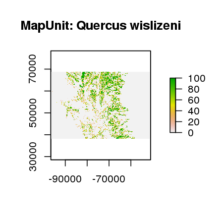

Vegetation classification:
==========================

Alternative source for entire DRECP area: 
[Land Cover/Natural Vegetation Communities](http://databasin.org/datasets/0a419342ec904b3c8fc710003f52ebe0#) 
-- just the various datasets merged but without names uniformized

Many datasets available at [this F&W page](http://www.dfg.ca.gov/biogeodata/gis/veg.asp)
or on [BIOS](https://map.dfg.ca.gov/bios/?bookmark=940).

Vegetation classification info at [vegetation.cnps.org](http://vegetation.cnps.org).

- [Desert vegtation classification](desert_veg)
    * downloaded from [BIOS](https://map.dfg.ca.gov/bios/?bookmark=534) on 11/24/15
    * by Todd Keeler-Wolf for DRECP
    * loads as a `SpatialPolygonsDataFrame`
    * [western](desert_veg/western/metadata.html)
        * vegetation classification recorded as `NVCSName`
        ```
        x <- readOGR("desert_veg/western/ds735.gdb","ds735")
        # to get total area by each
        sort( tapply(x$Shape_Area,x$NVCSName,sum) )
        # plot various alliances
        plot(subset(x,NVCSName=="Larrea tridentata - Ambrosia dumosa"),col=adjustcolor("black",0.5),border=NA)
        plot(subset(x,NVCSName=="Yucca brevifolia"),col=adjustcolor("red",0.5),border=NA,add=TRUE)
        plot(subset(x,NVCSName=="Viguiera parishii"),col=adjustcolor("green",0.5),border=NA,add=TRUE)
        plot(subset(x,NVCSName=="Larrea tridentata"),col=adjustcolor("grey",0.5),border=NA,add=TRUE)
        ```

    * [central](desert_veg/central/metadata.html)
        * vegetation classification recorded as `LABEL_1`
        * same as western
        ```
        x <- readOGR("desert_veg/central","ds166")
        # to get total area by each
        sort( tapply(x$AREA,x$LABEL_1,sum) )
        # this assigns the 'last' code overlapping a cell to that cell, numerically
        z <- rasterize(x,raster(extent(x),res=1000),"LABEL_1")
        # *percent* of each cell is covered by jtree:
        jtc <- rasterize(subset(x,LABEL_1=="Joshua Tree"),raster(extent(x),res=1000),getCover=TRUE)
        # To get a binary layer, for any cell that has some jtree overlapping:
        jt <- rasterize(subset(x,LABEL_1=="Joshua Tree"),raster(extent(x),res=1000),1)
        # not quite the same thing:
        jt2 <- rasterize(x,raster(extent(x),res=1000),x$LABEL_1=="Joshua Tree")
        table(values(jt),values(jt2))
        ```

    * [anza borrego](desert_veg/anza_borrego/metadata.html)
        * older project (1998)
        * different format: classification under `CALVEGNAME`?
        ```
        x <- readOGR("desert_veg/anza_borrego/ds165.gdb","ds165")
        ```

* [Northern Sierra Nevada Foothills](sierra_foothills)
    * downloaded from [BIOS](ftp://ftp.dfg.ca.gov/BDB/GIS/BIOS/Public_Datasets/500_599/ds566.zip) on 12/31/15
    * veg classification stored in `MapUnit`? (older version in `CalVeg`)
    * long and skinny
    * read in like this: 
        ```
        x <- readOGR("sierra_foothills/ds566.gdb","ds566")
        z  <- rasterize(subset(x,MapUnit=="Quercus wislizeni"),raster(extent(x),res=1000),getCover=TRUE)
        # total areas
        sort(tapply(x$Shape_Area,x$MapUnit,sum))
        ```

        

* [Central Valley Riparian](great_valley_riparian)
    * downloaded from [BIOS](ftp://ftp.dfg.ca.gov/BDB/GIS/BIOS/Public_Datasets/1000_1099/ds1000.zip)
    * read in like this: 
        ```
        x <- readOGR("great_valley_riparian/ds1000.gdb","ds1000")
        z  <- rasterize(x,raster(extent(x),res=1000))
        ```

* [Lassen Foothills](lassen)
    * downloaded from [BIOS](ftp://ftp.dfg.ca.gov/BDB/GIS/BIOS/Public_Datasets/500_599/ds564.zip) on 12/31/15
    * file format: MDB... use `Hmisc::mdb.get`...


Species distribution models:
==========================


Climate projection models
-------------------------

From environmental niche models, including various climate scenarios, for desert plant species, 
on [data basin](http://databasin.org/galleries/f6344e81da864023a9fb550231fdcafc):

How to get these into `R`, using *Mentzelia tridentata* as an example:

0.  In the downloaded `.zip` file, there's a `data/v93/tempgdb.gdb/` directory with various `gdb` files in it.
    (Find these with `find . -name gdb`.)

1.  This gives info about the files: `ogrinfo -al data/v93/tempgdb.gdb/` including the layer name

2.  This can convert the file to something `R` can manage: `ogr2ogr output_dirname data/v93/tempgdb.gdb/`

*Note:*  in R, this works, once `ogrinfo` has given us the layer name (here is `"Mentzelia_tridentata"`): 
`ogrInfo("mentzelia_tridentata",layer="Mentzelia_tridentata")`


**Mojave:**


- [Mentzelia tridentata](mentzelia_tridentata) (creamy blazing star)
    * relatively continuous
    * downloaded from [data basin](http://databasin.org/datasets/fe1ade4bfc0e4ba6967320cf1eb4d231) on 11/24/15
    * 270m

- [Eschscholzia minutiflora ssp twisselmannii](http://databasin.org/datasets/96a4bf19c331413b9c5acc783adcfabc) (red rock poppy)
    * sparser, with many snakey/linear bits

- [Mimulus mohavensis](http://databasin.org/datasets/5aa3a1a3a6cc47aa909de45cc63e46af) (Mojave monkeyflower)
    * lots of little sparse patches

- [Muhlenbergia appressa](http://databasin.org/datasets/efbac3d421d24d0386d0290b197197c8) (Devil's canyon muhly, a grass)
    * fewer, bigger patches

**Sonoran:**

    - [Senna covesii](http://databasin.org/datasets/857237fc5ff64a1584674bd274013ce8) (Coves' senna)
    * lots of big, connected patches

- [Astragalus insularis var harwoodii](http://databasin.org/datasets/73d2dafe5c2447aca58597f9a1a9984b) (Harwood's milkvetch)
    * semi-connected, smallish patches

- [Abronia villosa var aurita](http://databasin.org/datasets/8d888852c9d74c0499dcfba8b3f215e1) (desert sand-verbena)
    * widely distributed around on mountains


Current extent 
--------------

These are available through the [UCSB Bren school](http://www.biogeog.ucsb.edu/);
a big file containing TIFFs of ranges for many species is [available](ftp://ftp.biogeog.ucsb.edu/pub/org/biogeog/data/CEC_desert/Mojavset.rar).

- [Downloaded](ftp://ftp.biogeog.ucsb.edu/pub/org/biogeog/data/CEC_desert/Mojavset.rar) on 12/20/2015.
- Species ranges in [Mojavset/Spatial/targets/biodiversity/binary](Mojavset/Spatial/targets/biodiversity/binary).
- Load with e.g. `x <- raster("Mojavset/Spatial/targets/biodiversity/binary/Boechera_shockleyi_broad_extent_avg.tif")`.


Joshua Tree, from Cam Barrows
-----------------------------

Distribution now, and at +3 degrees C.
Files in [joshua_tree_niche](joshua_tree_niche), sent on 11/24/15:

>  These are old models, but I have attached models for current and a +3C summer maximum temperature future scenario.

- Citation:  (Biological Conservation, 2012)
- `SpatialPoints`, not polygons
- read layers with
    ```
    x0 <- readOGR(".","YUBRa_CVRR2_R2P1_H7c_joined")
    x3 <- readOGR(".","YUBRa_CVRR2_R2P1H7b+3C_joined")
    ```


Additional things on the maps
=============================


From Gideon's tortoise work:
```{r code="layer_utils.R"}
```

Various downloads on [Natural Earth](http://www.naturalearthdata.com/downloads/10m-raster-data/):
- [Shaded Relief](background/SR_HR/) from [http://www.naturalearthdata.com/http//www.naturalearthdata.com/download/10m/raster/SR_HR.zip]
- [Manual Shaded Relief](background/US_MSR_10M/) from [http://www.naturalearthdata.com/http//www.naturalearthdata.com/download/10m/raster/US_MSR_10M.zip]
